# Build and Integrate a Trust Provider to Citizen One

### Building a Trust Provider with the Citizen One Go SDK

As an example, we are going to build a Trust Provider for a Department of Motor Vehicles (DMV). The DMV uses a customer number and validation number found on the citizen's driver license along with their first and last names to validate accounts. The DMV knows the citizen's birth date and we are going to use this to implement a rule to check if the citizen is at least 19 years old. 

The completed trust provider can be viewed [here](./DMVTrustProvider.go).

#### 1. Bootstrap the trust provider
```
package main

import (
  "github.com/Vivvo/go-sdk/trust-provider"
  "log"
)

func main() {
  var onboarding trustprovider.Onboarding
  var rules []trustprovider.Rule
  log.Fatal(trustprovider.New(onboarding, rules).ListenAndServe())
}
```
Here we've declared two variables, onboarding and rules, that we will flesh out as we go. We've created a new trust provider with `trustprovider.New(onboarding, rules)` and by calling the `ListenAndServe` function on our new Trust Provider we've started an http server. By default the server will listen on port `3000` but you can easily change the port it listens on by setting an environment variable called `TRUST_PROVIDER_PORT` to your desired port number. 

#### 2. Define the onboarding parameters

As we said before the DMV will onboard with 4 parameters, customer number, validation number, first name, and last name. We can start fleshing out our onboarding object. 

```
onboarding := trustprovider.Onboarding{
    Parameters: []trustprovider.Parameter{
        {Name: "customerNumber", Required: true, Type: trustprovider.ParameterTypeString},
        {Name: "validationNumber", Required: true, Type: trustprovider.ParameterTypeString},
        {Name: "firstName", Required: true, Type: trustprovider.ParameterTypeString},
        {Name: "lastName", Required: true, Type: trustprovider.ParameterTypeString},
    },
}	
```

When Citizen One attempts to onboard a citizen with your Trust Provider it will call `http://host/api/register` with the parameters in the body of the POST request. The SDK will take care of unmarshalling those parameters, validating that they are present if marked as required and validating the types as configured. 

Here we've defined customerNumber and validationNumber as strings because the DMV has both customerNumbers and validationNumbers that begin with leading zeros.

#### 3. Build the onboarding function

The onboarding function should connect to your internal systems and implement your business logic for asserting that the parameters submitted are sufficient for linking the Citizen One account to your internal system.

As an example, we will use a simple CSV file as our backing store. We definitely do not recommend using a CSV file in production scenarios. We expect that your onboarding function will e.g.: make rest calls to an internal system, or connect directly to a database.

```
type DMVAccount struct {
	CustomerNumber   string `json:"customerNumber"`
	ValidationNumber string `json:"validationNumber"`
	FirstName        string `json:"firstName"`
	LastName         string `json:"lastName"`
	BirthDate        string `json:"birthDate"`
	Token            string `json:"token"`
}

func onboarding(s map[string]string, n map[string]float64, b map[string]bool, i map[string]interface{}) (interface{}, error) {
	reader, _ := os.Open("./DMVUsers.csv")
	defer reader.Close()
	r := csv.NewReader(reader)
	records, _ := r.ReadAll()

	for _, r := range records[1:] {
		if strings.Compare(r[0], s["customerNumber"]) == 0 && strings.Compare(r[1], s["validationNumber"]) == 0 && strings.Compare(r[2], s["firstName"]) == 0 && strings.Compare(r[3], s["lastName"]) == 0 {
			return DMVAccount{CustomerNumber: r[0], ValidationNumber: r[1], FirstName: r[2], LastName: r[3], BirthDate: r[4], Token: r[5]}, nil
		}
	}
	return nil, errors.New("no match found")
}
``` 

Here we've defined a type `DMVAccount` and implemented a function called `onboarding`. The signature of the function must match the on that our Onboarding object expects (see [godocs](https://godoc.org/github.com/Vivvo/go-sdk/trust-provider#Onboarding)). The parameters `s`, `n`, and `b` will be passed in by the SDK when the onboarding endpoint is called and it succesfully unmarshals the POST request body. We have separated the parameters in to maps of strings, numbers and booleans for ease of use. The `DMVAccount` can be whatever you like and will be used later for linking tokens to accounts and evaluating rules. 

This function will read a file in the current directory called `DMVUsers.csv` that it expects it to have entries in the following format:
```
customerNumber, validationNumber, firstName, lastName, birthDate, token
```

If a record that meets all the business requirements is found, then we return a new instance of DVMAccount. Otherwise we return a new error with a simple message saying `no match found`. The SDK will include this message in the response body for a failed onboarding attempt and may help with diagnostics if users fail onboarding. *Do not include any private data in the error message*.

Now that we've created our onboarding function we can include that in the onboarding object we are building: 

```
onboarding := trustprovider.Onboarding{
    Parameters: []trustprovider.Parameter{
        {Name: "customerNumber", Required: true, Type: trustprovider.ParameterTypeString},
        {Name: "validationNumber", Required: true, Type: trustprovider.ParameterTypeString},
        {Name: "firstName", Required: true, Type: trustprovider.ParameterTypeString},
        {Name: "lastName", Required: true, Type: trustprovider.ParameterTypeString},
    },
    OnboardingFunc: onboarding,
}
```

#### 4. Build a struct that implements the Account interface

The Account interface (see [godoc](https://godoc.org/github.com/Vivvo/go-sdk/trust-provider#Account)) is needed to udpate and read user accounts from your internal system.
```
Update(account interface{}, token uuid.UUID) error
Read(token uuid.UUID) (interface{}, error)
```
The update function is used to link a token to an account in your system. The read function is used to read an account by the token so we can pass it in to the rule evaluation functions.

There is a default implementation of the Account interface that simply stores the token and the account returned from the OnboardingFunc in a json file in the current directory. This is fine for development purposes, but we definitely do not recommend it for production scenarios.

As an example, we will implement a struct `DMVAccountManager` that implements the Account interface and read/writes accounts to the same csv file as the onboarding function.
```
type DMVAccountManager struct {}

func (d *DMVAccountManager) Update(account interface{}, token uuid.UUID) error {
	reader, _ := os.Open("./DMVUsers.csv")
	r := csv.NewReader(reader)
	records, _ := r.ReadAll()
	reader.Close()

	if a, ok := account.(DMVAccount); ok {
		for _, r := range records[1:] {
			if strings.Compare(r[0], a.CustomerNumber) == 0 {
				r[5] = token.String()
			}
		}

		file, _ := os.OpenFile("./DMVUsers.csv", os.O_RDWR, 0777)
		writer := csv.NewWriter(file)
		writer.WriteAll(records)
		defer file.Close()
		return nil
	} else {
		return errors.New("invalid account object")
	}
}

func (d *DMVAccountManager) Read(token uuid.UUID) (interface{}, error) {
	reader, _ := os.Open("./DMVUsers.csv")
	defer reader.Close()
	r := csv.NewReader(reader)
	records, _ := r.ReadAll()

	for _, r := range records[1:] {
		if strings.Compare(r[5], token.String()) == 0 {
			return DMVAccount{CustomerNumber: r[0], ValidationNumber: r[1], FirstName: r[2], LastName: r[3], BirthDate: r[4], Token: r[5]}, nil
		}
	}
	return nil, errors.New("not match found")
}
```

We can then update our Trust Provider to use our new `DMVAccountManager`

```
tp := trustprovider.New(onboarding, rules, &DMVAccountManager{})
```

#### 5. Define the "Is 19 Years Old" Rule

Our next step is to start building the rule. First we need to include it in the array of Rules that get passed in to the trust provider.

```
rules := []trustprovider.Rule{
     {Name: "is19yearsold", Parameters: []trustprovider.Parameter{}, RuleFunc: is19YearsOld},
}	
```

Rules can have parameters just like the onboarding function, however for our purposes, we won't need to take in any parameters. If we had defined any parameters, they would be parsed, validated and passed in to the rule function as well. The signature of the rule function must match the one the rule object expects (see [godoc](https://godoc.org/github.com/Vivvo/go-sdk/trust-provider#Rule)).

```
func is19YearsOld(s map[string]string, n map[string]float64, b map[string]bool, i map[string]interface{}, acct interface{}) (bool, error) {
	if a, ok := acct.(DMVAccount); ok {
		birthDate, err := time.Parse("2006-01-20", a.BirthDate)
		if err != nil {
			return false, errors.New("unable to parse birth date")
		}
		turns19Date := birthDate.AddDate(19, 0, 0)
		return turns19Date.Before(time.Now()) || turns19Date.Equal(time.Now()), nil
	} else {
		return false, errors.New("not a valid account object")
	}
}
```

The SDK will call the `is19YearsOld` function when an HTTP POST request is made to `/api/is19yearsold/{token}` where the token is the one that was generated in the onboarding process and stored both in Citizen One and your internal system. The SDK takes care of reading the account from your system (thanks to the `DMVAccountManager` we wrote) and passes it in to the rule function as the `acct` parameter. Since the SDK doesn't know the type of object you will use to represent your users we pass it in as an `interface{}` and you must assert that it is the type you expected, in this case, `DMVAccount`. 

Trust Provider rules always return a simple true or false. The SDK will handle wrapping that response in the appropriate body and response codes.

That's all we need to do for our Trust Provider. Now we move on to configuring the Trust Provider and Rule in the Citizen One Management application. 

#### 6. Configure the "Is 19 Years Old" Rule 

Navigate to the Citizen One Management App i.e.: https://yourdomain.com/management/#/home and click on the Trust card:  
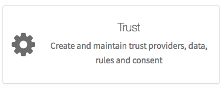

On the trust providers page select the Rules tab and then click on the 'Create Rule' button
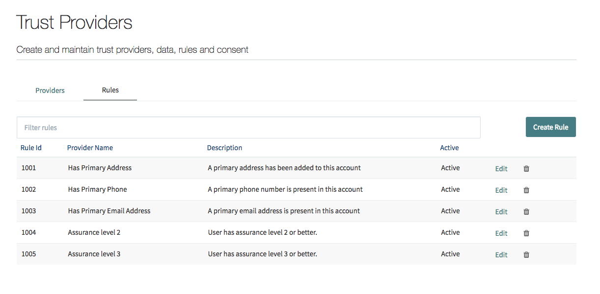

A modal window will pop up, fill out the name, description, callout path. We don't need any parameters for this rule. 
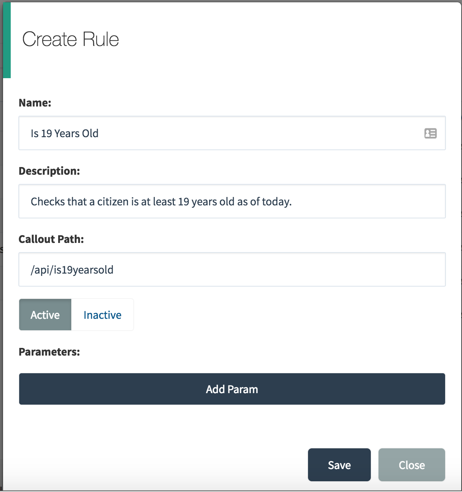

Click save, and now we're ready to set up our Trust Provider and configure the rule with it. 

#### 7. Create an onboarding Form

For citizen's to be able to onboard automatically with your Trust Provider, we need to create a form in Citizen One's no-code form builder. Navigate to the form builder management app, i.e.: http://yourdomain.com/formbuilder/ 
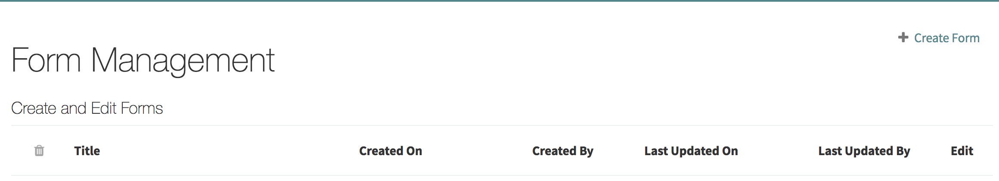

Click on the `Create Form Link` and in the modal that pops up fill out the name, description, and associate the form with your organization and the Citizen One application. 
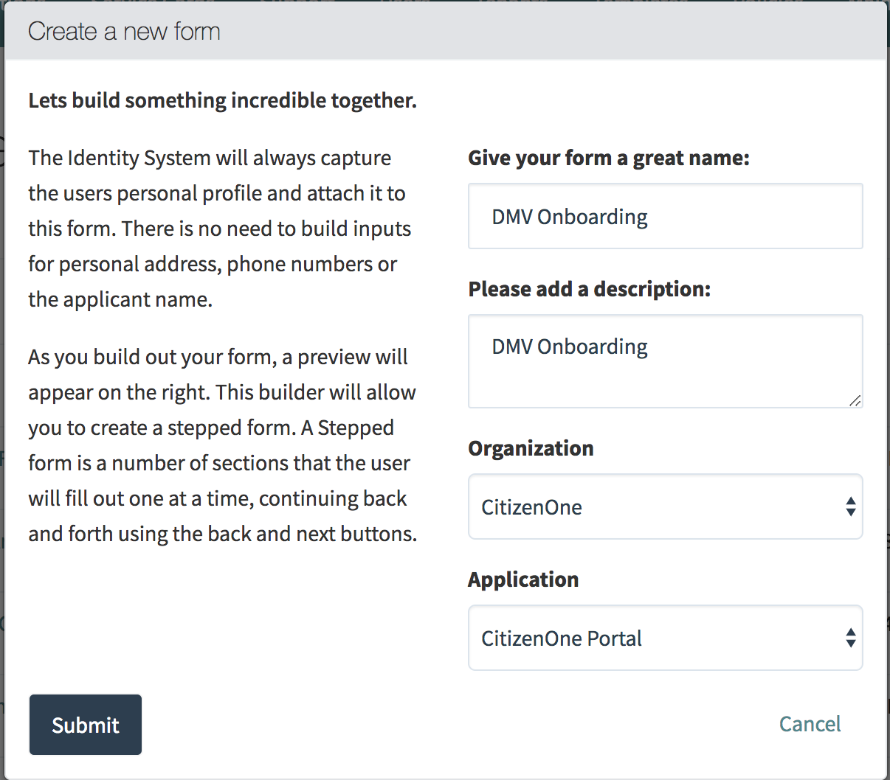

Build a form that takes in the 4 parameters we defined earlier in our Trust Provider being sure to modify the controls' unique ID's to match the parameter names your Trust Provider expects.
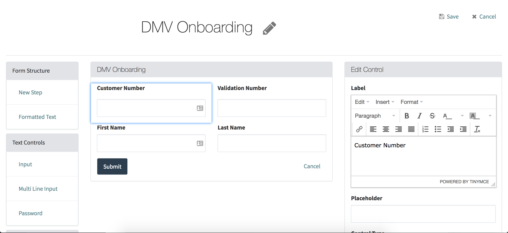

If you want to get really fancy, you can add some images, explanatory paragraphs, etc... 
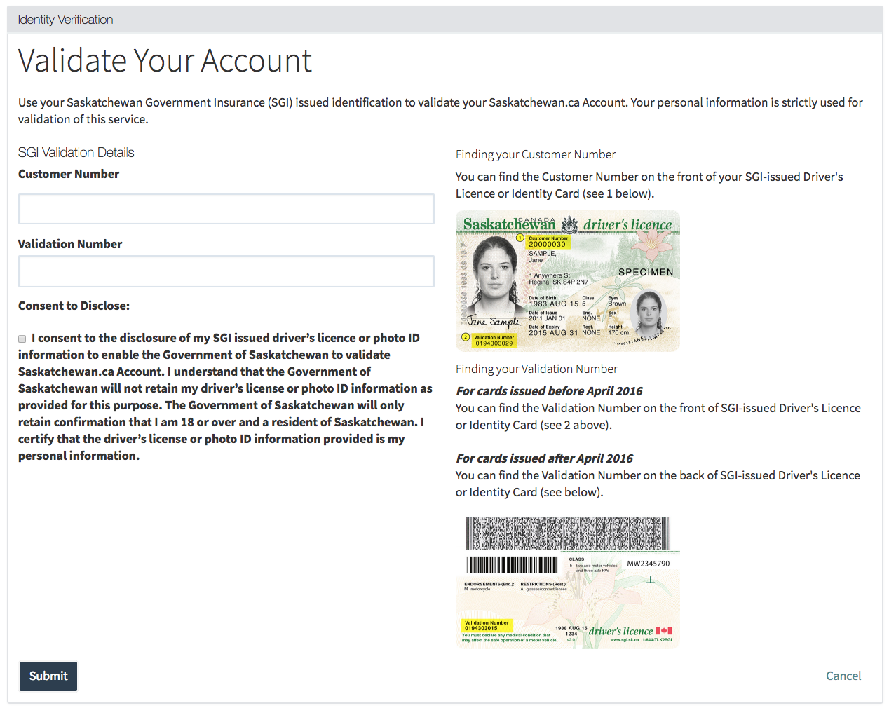

#### 8. Configure a new Trust Provider
Navigate back to the Citizen One Management App i.e.: https://yourdomain.com/management/#/home and click on the Trust card again.

On the  Trust Providers tab, and click the `Create Provider` button
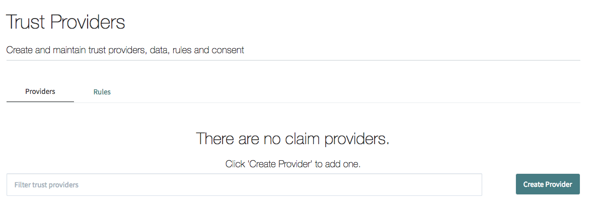

In the Create Claim Provider modal that pops up fill out the name, description, level of assurance, base URL and onboarding path: 
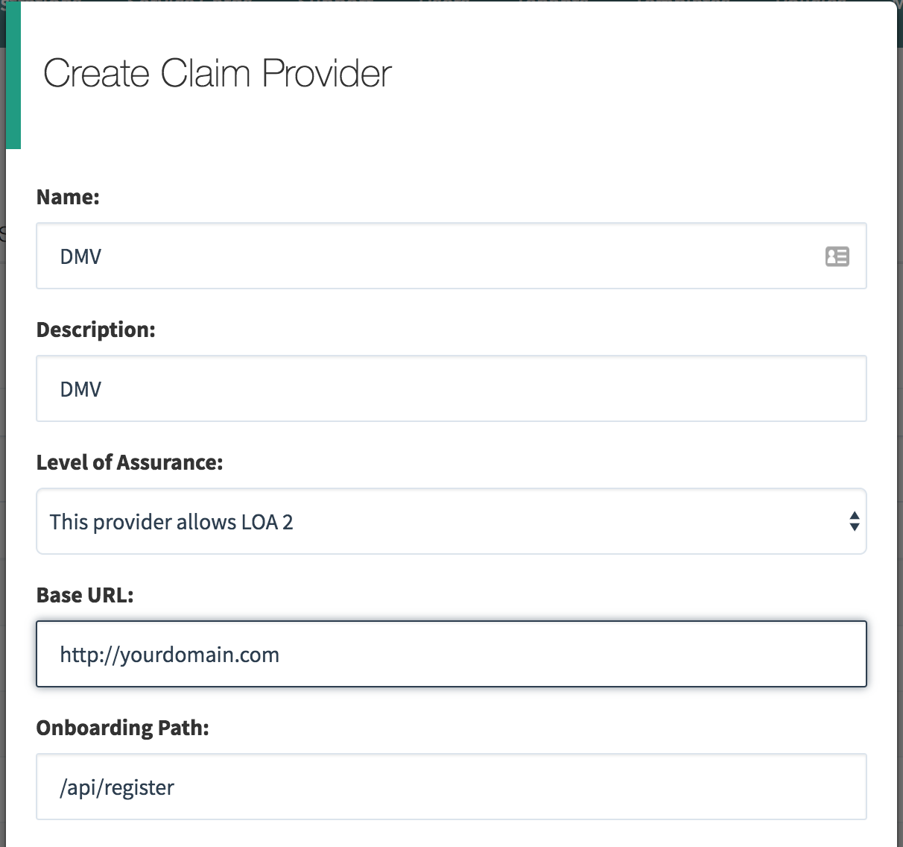

Fill out the onboarding path, select the form we just created and add the parameters that are required for onboarding.
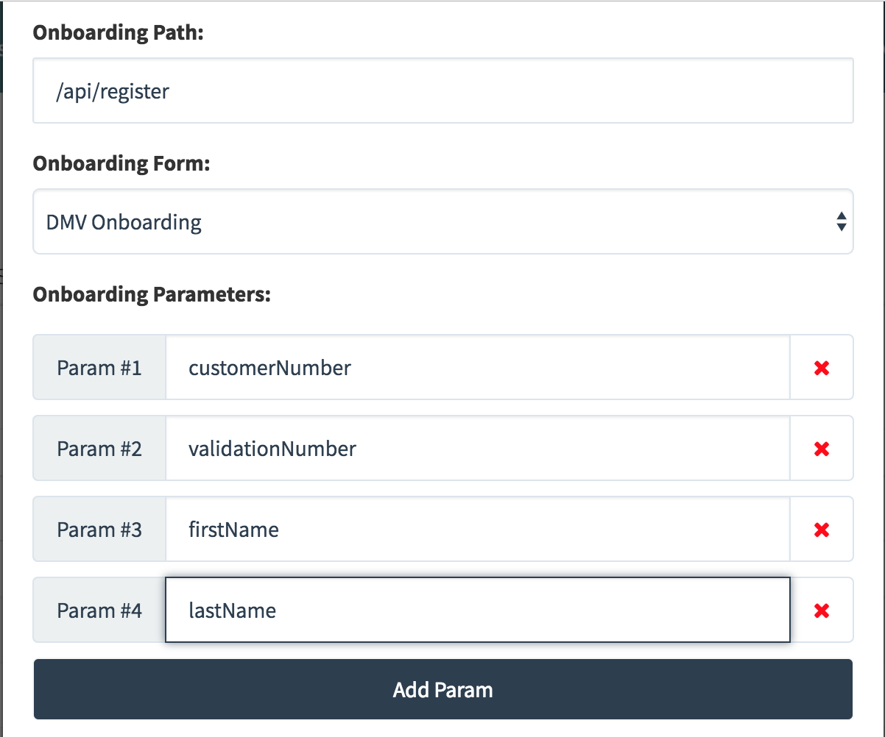

Add a rule and select the `Is 19 Years Old` rule we created before. The description is the friendly description citizens will see when they successfully onboard and pass this rule. 
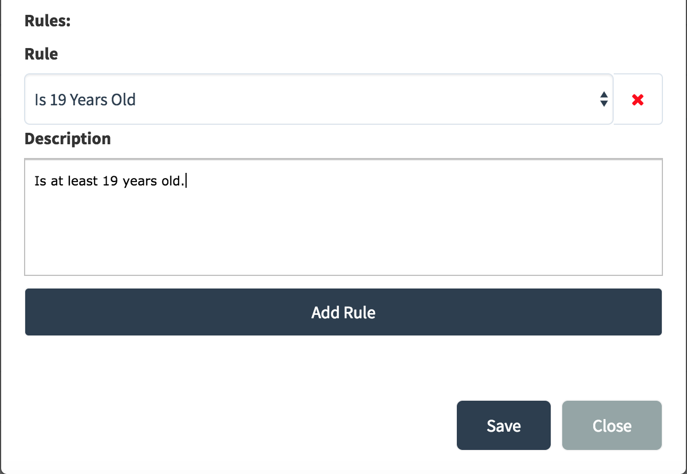

#### That's it!
 You have successfully built and configured your first Citizen One Trust Provider. You can now associate the rule you created with applications and the platform with facilitate onboarding with your Trust Provider and checking rules against it. 